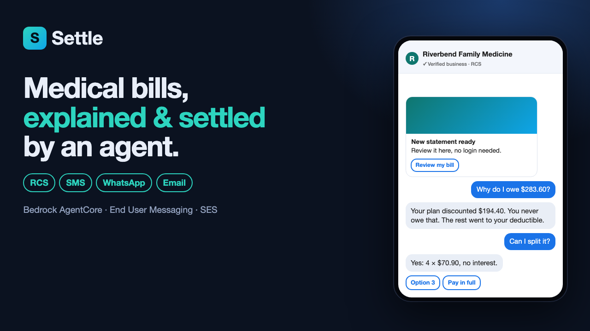
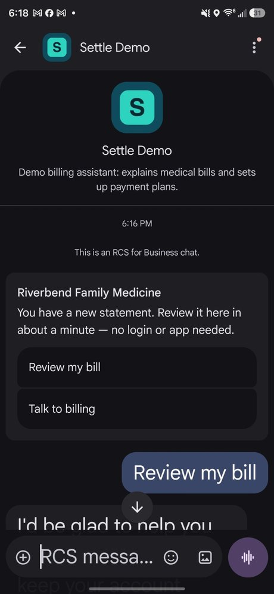
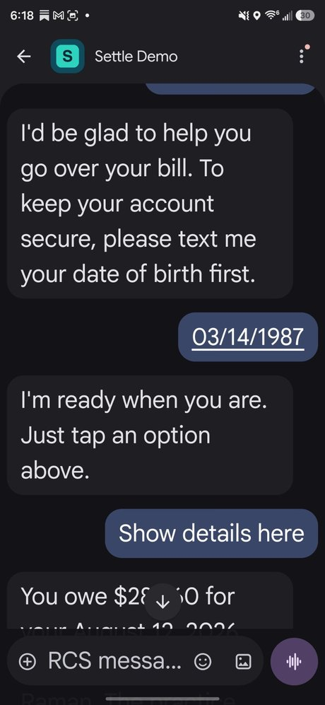
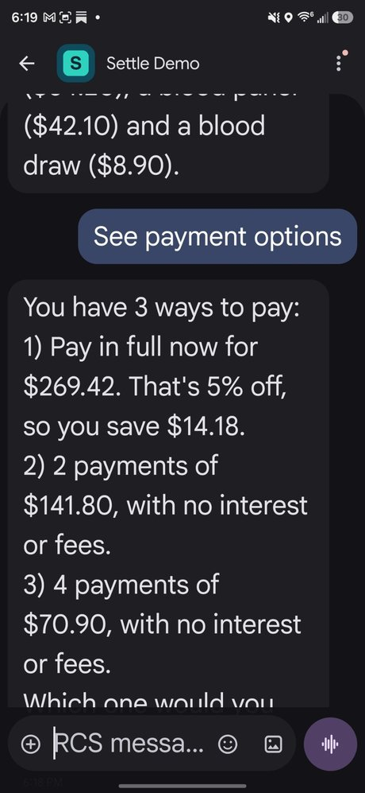
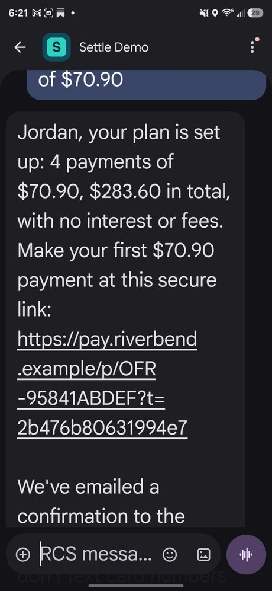
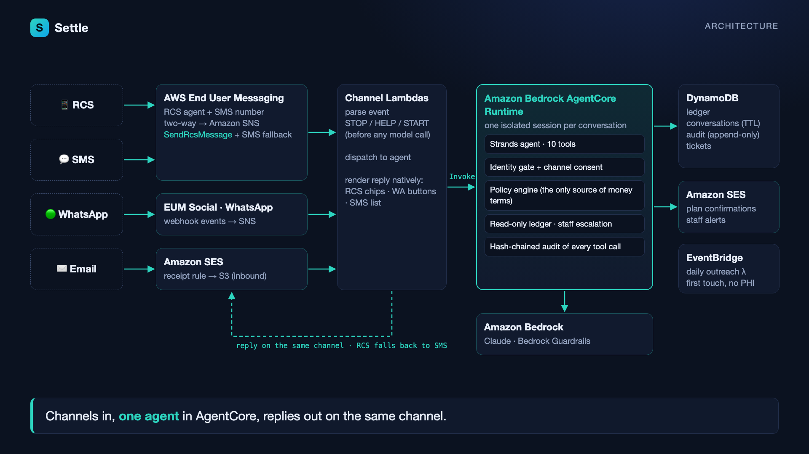

# Settle

**An agentic patient-billing assistant that explains a medical bill, sets up a payment plan and escalates disputes. It works over RCS, SMS, WhatsApp and email.**

Built on **Amazon Bedrock AgentCore Runtime** (a Strands agent running Claude on Bedrock), **AWS End User Messaging** (RCS + SMS), **AWS End User Messaging Social** (WhatsApp) and **Amazon SES**.

[](submission/settle_demo.mp4)

**Live site:** https://settle-agent-khaki.vercel.app · **Demo video (3 min):** [submission/settle_demo.mp4](submission/settle_demo.mp4) · captions in [settle_demo.srt](submission/settle_demo.srt) · rebuilt from real runs by [media/build_video.py](media/build_video.py)

## Live on a real phone

This is an unedited RCS conversation on an Android phone (Google Messages). Every reply came from the deployed AgentCore runtime (Claude on Bedrock), with synthetic patient data.

| First touch (no PHI) | Verify, then consent | Policy-issued options | Enrolled, with a secure link |
|:---:|:---:|:---:|:---:|
|  |  |  |  |

The run also surfaced two bugs, both now fixed:
- RCS delivers suggestion taps as JSON, so a tapped **YES** wasn't recognized as the patient's confirmation.
- Text the model wrote before a tool call was dropped. That's the stray "Just tap an option above" in screenshot 2.

## Architecture



## The problem

After a visit, the patient gets a statement full of procedure codes and adjustment codes. It shows a balance, but not why they owe it. Patients call during business hours, wait on hold, or put it off, and the balance ages into collections. Billing staff spend their day answering the same three questions:

* Why do I owe this?
* Can I split it?
* I already paid.

## What Settle does

| | |
|---|---|
| **Explain** | It translates the adjudicated claim line by line: billed, insurance discount (never owed), and the patient's share with the reason (deductible, copay, coinsurance). |
| **Arrange** | It offers only the payment options the practice's policy engine issues. Enrolment needs the patient's own "yes". Payment happens through a hosted link, and SES sends the confirmation. |
| **Escalate** | For disputes, hardship, "I already paid" or anything unusual, it investigates read-only and opens a staff ticket with the evidence and a recommended fix. |

It talks to patients in their language on the channel they chose. The first contact is an RCS rich card (with SMS fallback), a WhatsApp template or an email, and it contains no health information.

## Design principle: policy lives in code, not the prompt

The model decides *what to say* and *which tool to call*. The tools decide *what is allowed*:

| Guardrail | Enforced in | Test |
|---|---|---|
| No account details before identity verification (number on file + date of birth) | `settle/tools.py` `_need_verified` | `test_no_phi_before_verification` |
| Three failed verifications lock the chat and page staff | `verify_identity` | `test_three_misses_locks_and_pages_staff` |
| Visit details (services, dates, providers) need channel consent; balances do not | `get_account_summary`, `explain_statement` | `test_balance_ok_but_visit_details_need_consent` |
| Money terms come only from the policy engine (≤4 installments, $25 minimum, no interest, 5% prompt-pay) | `settle/policy.py` | `test_policy_refuses_off_menu_terms` |
| Enrolment needs an issued `offer_id` **and** the patient's latest message to be an explicit yes | `accept_offer` | `test_cannot_enrol_without_issued_offer_or_patient_yes` |
| The agent never moves money or edits the ledger | read-only `Ledger`; `investigate_payment` | `test_already_paid_finds_unapplied_credit_but_moves_no_money` |
| STOP / HELP / START are handled before any model call | `settle/router.py` | `test_stop_keyword_handled_before_model` |
| Unknown senders learn nothing (no confirm-or-deny) | `settle/router.py` | `test_unknown_sender_learns_nothing` |
| Every tool call goes into a SHA-256 hash-chained, append-only audit log (no PHI) | `settle/audit.py` | `test_audit_chain_detects_tampering` |
| The first touch carries no PHI | `outbound.statement_card` | `test_outbound_rendering` |

Bedrock Guardrails (prompt-attack and content filters) sit on top of this as defence in depth. They are not the primary control.

## Repo layout

```
settle/             agent core, shared by AgentCore Runtime and tests
  agent.py          Strands agent: system prompt + 10 tools bound to a ToolContext
  tools.py          the tools and every guardrail
  policy.py         practice financial policy (the only source of money terms)
  ledger.py         read-only practice-management ledger (JSON locally, DynamoDB deployed)
  carc.py           claim adjustment codes -> plain language (EN/ES), allow-listed
  audit.py          hash-chained audit log
  state.py          per-conversation state (verification lives here, not in model context)
  router.py         one inbound message -> keywords -> agent turn -> reply
  offline.py        deterministic planner for tests and offline demos (same tools, same guardrails)
  channels/         inbound parsers (EUM SMS/RCS, EUM Social, SES) + outbound senders
agentcore/app.py    BedrockAgentCoreApp entrypoint
lambdas/            channel Lambdas (SNS/S3 -> InvokeAgentRuntime -> reply) + daily outreach
infra/              AWS CDK (Python): DynamoDB x4, AgentCore CfnRuntime, SNS, Lambdas, SES, EventBridge
sim/run_demo.py     runs the two demo conversations end to end (offline or Bedrock)
scripts/            package.sh (build artifacts), seed_ledger.py, invoke_runtime.py (drive the deployed runtime)
media/              renders the demo video from the simulator's real output (Chrome + say + ffmpeg)
data/               synthetic ledger (fictional practice, patients, payers)
```

## Run it locally (no AWS needed)

```bash
uv venv -p 3.12 .venv && uv pip install -p .venv -e ".[dev]"
.venv/bin/python -m pytest -q          # guardrail tests
.venv/bin/python -m sim.run_demo        # both demo conversations, offline planner
```

To run the same conversations through the real Strands agent on Bedrock, use your own AWS credentials:

```bash
AWS_PROFILE=<profile> SETTLE_MODEL=bedrock .venv/bin/python -m sim.run_demo
```

To run them against the **deployed** AgentCore runtime (after `cdk deploy` + seeding):

```bash
AWS_PROFILE=<profile> .venv/bin/python scripts/invoke_runtime.py
```

## Deploy

See [docs/DEPLOY.md](docs/DEPLOY.md). In short: `scripts/package.sh`, then `cdk deploy`, then seed the ledger, then point the RCS agent's two-way SNS topic and the WhatsApp event destination at the stack outputs.

## Data

All data is synthetic. The practice, patients, providers and payers are fictional, and the phone numbers use the 555-01xx range.

## License

MIT
